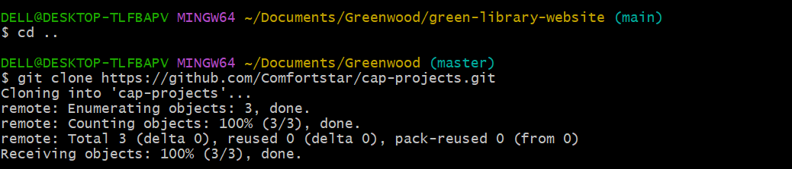
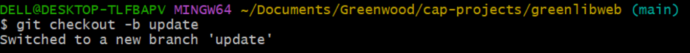

# CAPSTONE PROJECT ON GIT
## GIT AND GITHUB
Git is a free, open source version control that tracks changes to computer file.
Github on the other hand is a web-based platform that allows code, web pages, and other content like store and share code.

Below are the following command lines use on git:

1. GIT CLONE: This command is used to clone a repository from github to the computer using the url address after creating a repository on our github account.
   
   
   Using the cd command line, directory is change to the cloned repository.
   
   
   
   2. Create a file in the working directory using the touch command or vim command. Vim is a file editor, it can create file and also used to edit file.
   
   
   3. git status: This displays the state of the working directory and staging area.
   
   

   4. git add . : git add is use to stage changes.

    

    

    5. git commit: This takes whatever is currently in thr staging area and wraps it into a new commit snapshot.

   

   6. git push: This command is used to upload local repository content to remote repository.
   
   

   7. git checkout -b : This command is use to create a branch on the main branch.
   
   

   8. pull request: Pull request is a way for developers to propose and review changes to code before merging thrm into a project´s main branch.

## In summary:
I created a repository on github, cloned it into my local terminal. changed my directory into the cloned environment.
created four files using vim, git add them, commit and pushed them into my remote repository. 
created 2 branches, createda file in each branch, git add all, commit and git push.
created a pull request for the branches with not conflict, and merged into the main branch. 
